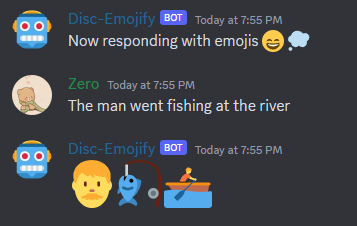
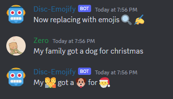
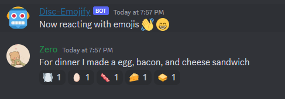

# Disc-Emojify 🤖

## An LSTM Model that Converts Text-to-Emojis Integrated into a Discord Bot! 🧑‍💻
This project is my first attempt at a recurrent neural network (RNN). This was created for my project and portfolio IV class at Full Sail University. Project scope was one month.
### Model's Features 📋
- Tokenized Descriptions
- Padded Sequences
- Scikit-Learn train_test_split
- TensorFlow Keras Model
- Adam Optimizer
- Trained On Over 700 Emojis
### Model's Layers ⚙️
- Embedding for Input
- Long Short-Term Memory (LSTM) with 128 units
- Long Short-Term Memory (LSTM) with 56 units
- Dense for Output using Softmax Activiation
### Bot's Features 🗂️
- Locally Hosted
- Command Event Handling
- On_Message Event Handling

## Respond Command 📢

## Replace Command ✍️

## React Command 🏷️

## Project Portfolio 🖥️
<a href='https://ethanstanks.github.io/emojify.html'>Disc-Emojify Portfolio Link</a>
